# customer-affinity-segmentation

## Unsupervised Machine Learning · Bertelsmann Arvato Analytics · Udacity ML Engineer Project

<div align="center">


</div>

---

## Table of Contents

1. [Project Overview](#-project-overview)
2. [Business Problem](#-business-problem)
3. [Dataset](#-dataset)
4. [Architecture & Pipeline](#-architecture--pipeline)
5. [Methodology](#-methodology)
6. [Key Results](#-key-results)
7. [Standout Analyses](#-standout-analyses)
8. [Alternative Clustering — Robustness Evaluation](#-alternative-clustering--robustness-evaluation)
9. [Repository Structure](#-repository-structure)
10. [Getting Started](#-getting-started)
11. [Limitations](#-limitations)
12. [Future Research](#-future-research)
13. [References](#-references)

---

## Project Overview

This project applies **unsupervised machine learning** to identify which segments of the German general population are most likely to become customers of a mail-order company operated by **Bertelsmann Arvato Analytics**. With no purchase-intent labels available, the entire analysis relies on discovering the latent demographic structure of the population through clustering, then comparing that structure against the known customer base.

| Attribute | Detail |
|---|---|
| **Client** | Bertelsmann Arvato Analytics / AZ Direct GmbH |
| **Domain** | Direct Marketing · Customer Analytics |
| **Task Type** | Unsupervised Learning — Clustering & Segmentation |
| **Population Dataset** | 891,211 persons × 85 features |
| **Customer Dataset** | 191,652 persons × 85 features |
| **Final Clusters** | **12** (validated by Elbow + Silhouette dual-method) |
| **Variance Retained** | ~89% (30 principal components) |
| **Core Methods** | PCA · K-Means · Silhouette Analysis · Penetration Rate |
| **Runtime (full dataset)** | ~20–40 min on a modern CPU |

> **Data Notice:** The AZDIAS and CUSTOMERS datasets are proprietary to Bertelsmann Arvato Analytics, provided under a confidential data agreement via Udacity. They are **not included** in this repository and must be deleted within 2 weeks of project completion per agreement terms.

---

## Business Problem

Mail-order companies face a fundamental resource allocation challenge: **without knowing which demographic segments are receptive to their products**, campaign budgets are spread inefficiently across the full population, yielding high waste and low marginal return.

Formally, given a high-dimensional demographic matrix **X ∈ ℝⁿˣᵖ** (n = 891,211, p = 85 → 61 after cleaning), the goal is to find a mapping:

```
f: X → {1, ..., K}
```

such that:
- **(a)** intra-cluster demographic similarity is maximised
- **(b)** inter-cluster separation is maximised
- **(c)** resulting clusters reveal measurable differences in customer density

**Success criteria:** Interpretable, stable clusters → ranked segment affinity scores → actionable campaign targeting decisions.

---

## Dataset

Four files are used, all sourced from Bertelsmann Arvato Analytics:

### Primary Data Files

| File | Rows | Columns | Role |
|---|---|---|---|
| `Udacity_AZDIAS_Subset.csv` | 891,211 | 85 | General population — **model training** |
| `Udacity_CUSTOMERS_Subset.csv` | 191,652 | 85 | Existing customers — **scoring only** |

### Reference Files

| File | Description |
|---|---|
| `AZDIAS_Feature_Summary.csv` | 85×4 metadata: feature name, information level, type, missing-value codes |
| `Data_Dictionary.md` | Full encoding guide for all feature categories |

### Feature Breakdown (After Preprocessing)

| Feature Type | Raw Count | After Cleaning | Notes |
|---|---|---|---|
| Ordinal | 49 | 39 | Kept as numeric interval |
| Categorical (binary) | 21 | 6 | Multi-level dropped; `OST_WEST_KZ` re-encoded |
| Numeric / Interval | 8 | 8 | Unchanged |
| Mixed (engineered) | 7 | 4 | 2 decomposed → 4 new features; 3 dropped |
| High-miss removed | — | −9 cols | >20% missing threshold applied |
| **Total** | **85** | **61** | |

### Feature Information Levels

Features span five collection levels — person, household, building, neighbourhood, and PLZ8 postal region — covering personal attributes (age, personality typology, financial orientation), household characteristics (size, residential environment), and postal/regional attributes (municipality type, urban distance).

---

## Architecture & Pipeline

### Data Science Flow

```mermaid
flowchart TD
    %% ── NODE STYLES ──────────────────────────────────────────────
    classDef inputStyle    fill:#1a3a5c,stroke:#4a9eda,stroke-width:2px,color:#ffffff,font-weight:bold
    classDef prepStyle     fill:#6b2d8b,stroke:#b06ed4,stroke-width:2px,color:#ffffff,font-weight:bold
    classDef engStyle      fill:#b5451b,stroke:#e8845a,stroke-width:2px,color:#ffffff,font-weight:bold
    classDef scaleStyle    fill:#0e6655,stroke:#52be80,stroke-width:2px,color:#ffffff,font-weight:bold
    classDef reduceStyle   fill:#1a5276,stroke:#5dade2,stroke-width:2px,color:#ffffff,font-weight:bold
    classDef clusterStyle  fill:#7d6608,stroke:#f4d03f,stroke-width:2px,color:#ffffff,font-weight:bold
    classDef compareStyle  fill:#922b21,stroke:#e74c3c,stroke-width:2px,color:#ffffff,font-weight:bold
    classDef outputStyle   fill:#145a32,stroke:#27ae60,stroke-width:2px,color:#ffffff,font-weight:bold
    classDef standoutStyle fill:#4a235a,stroke:#9b59b6,stroke-width:2px,color:#ffffff,font-weight:bold
    classDef decisionStyle fill:#2c3e50,stroke:#95a5a6,stroke-width:2px,color:#ffffff,font-weight:bold,shape:diamond

    %% ── DATA INGESTION ───────────────────────────────────────────
    subgraph ING["📥 DATA INGESTION"]
        direction LR
        A1["🗂️ AZDIAS_Subset.csv\n891,211 × 85"]:::inputStyle
        A2["🗂️ CUSTOMERS_Subset.csv\n191,652 × 85"]:::inputStyle
        A3["📋 Feature_Summary.csv\nMissing-value codes"]:::inputStyle
        A4["📖 Data_Dictionary.md\nFeature encodings"]:::inputStyle
    end

    %% ── MISSING VALUE TREATMENT ──────────────────────────────────
    subgraph MVT["🔧 MISSING VALUE TREATMENT"]
        direction TB
        B1["Parse sentinel codes\n−1 · 0 · 'XX' → NaN"]:::prepStyle
        B2{"Column\nmissing > 20%?"}:::decisionStyle
        B3["❌ Drop 9 columns\nAGER_TYP · GEBURTSJAHR\nTITEL_KZ + 6 others"]:::prepStyle
        B4{"Row missing\n> 10 values?"}:::decisionStyle
        B5["⚠️ Separate to\nazdias_high_miss\n(tracked as segment −1)"]:::prepStyle
        B6["✅ azdias_clean\nMain training subset"]:::prepStyle
    end

    %% ── FEATURE ENGINEERING ──────────────────────────────────────
    subgraph FE["⚙️ FEATURE ENGINEERING"]
        direction TB
        C1["Re-encode OST_WEST_KZ\n'W'→1  'O'→0"]:::engStyle
        C2["Drop multi-level\ncategoricals\n(> 2 unique levels)"]:::engStyle
        C3["Engineer PRAEGENDE_JUGENDJAHRE\n→ DECADE (40–90)\n→ MAINSTREAM (0/1)"]:::engStyle
        C4["Engineer CAMEO_INTL_2015\n→ CAMEO_WEALTH (tens)\n→ CAMEO_LIFE_STAGE (ones)"]:::engStyle
        C5["Drop remaining mixed\nLP_LEBENSPHASE · WOHNLAGE\nCAMEO_DEU_2015 + others"]:::engStyle
        C6["Numeric projection\nAll object cols → float\nKeep only numeric"]:::engStyle
    end

    %% ── SCALING & IMPUTATION ─────────────────────────────────────
    subgraph SI["📐 IMPUTATION & SCALING"]
        direction LR
        D1["SimpleImputer\nstrategy='median'\nFIT on azdias_clean"]:::scaleStyle
        D2["StandardScaler\nmean=0  std=1\nFIT on azdias_clean"]:::scaleStyle
        D3["⚡ TRANSFORM ONLY\napplied to customers\n(no re-fitting)"]:::scaleStyle
    end

    %% ── DIMENSIONALITY REDUCTION ─────────────────────────────────
    subgraph DR["🔬 DIMENSIONALITY REDUCTION"]
        direction TB
        E1["PCA — Full Components\n85 → 61 features\nScree plot analysis"]:::reduceStyle
        E2{"Cumulative\nvariance ≥ 89%?"}:::decisionStyle
        E3["PCA — 30 Components\nRetains ~89% variance\nFIT on azdias_scaled"]:::reduceStyle
        E4["⚡ TRANSFORM ONLY\nCustomers projected\ninto PCA space"]:::reduceStyle
    end

    %% ── CLUSTER EVALUATION ───────────────────────────────────────
    subgraph CE["📊 CLUSTER COUNT EVALUATION  k = 2 → 20"]
        direction LR
        F1["WCSS / Inertia\nElbow Method\nk = 2–20"]:::clusterStyle
        F2["Silhouette Score\nSample n=5,000\nper iteration"]:::clusterStyle
        F3{"Elbow + Silhouette\nconverge on\nk = 10–13?"}:::decisionStyle
        F4["✅ Select k = 12\nBoth methods agree\nDiminishing returns > k12"]:::clusterStyle
    end

    %% ── FINAL CLUSTERING ─────────────────────────────────────────
    subgraph FC["🎯 FINAL K-MEANS MODEL"]
        direction LR
        G1["KMeans\nn_clusters=12\nn_init=10\nrandom_state=42\nFIT on azdias_pca"]:::clusterStyle
        G2["PREDICT\nCluster labels\nfor AZDIAS"]:::clusterStyle
        G3["⚡ PREDICT ONLY\nCluster labels\nfor CUSTOMERS"]:::clusterStyle
    end

    %% ── COMPARISON & INTERPRETATION ──────────────────────────────
    subgraph CI["📈 COMPARISON & INTERPRETATION"]
        direction TB
        H1["Cluster Proportion\nComparison\nPop % vs Cust %"]:::compareStyle
        H2["Cust / Pop Ratio\nper cluster\nOver- & underrep."]:::compareStyle
        H3["Centroid Inverse\nTransform\npca⁻¹ → scaler⁻¹\n→ feature space"]:::compareStyle
    end

    %% ── STANDOUT ANALYSES ────────────────────────────────────────
    subgraph SA["⭐ STANDOUT ANALYSES"]
        direction LR
        I1["🗺️ Demographic\nProfile Heatmap\n12 clusters × 16 features\nZ-scored vs population"]:::standoutStyle
        I2["📉 Customer\nPenetration Rate\n(Cust_k/N_cust) ÷\n(Pop_k/N_pop)"]:::standoutStyle
    end

    %% ── OUTPUTS ──────────────────────────────────────────────────
    subgraph OUT["✅ OUTPUTS"]
        direction LR
        J1["🎯 Core Target\nClusters\nRate ≥ 1.4×"]:::outputStyle
        J2["🟡 Moderate\nClusters\n0.85–1.4×"]:::outputStyle
        J3["❌ Low Priority\nClusters\nRate < 0.85×"]:::outputStyle
        J4["📊 Campaign\nTargeting Brief\nBudget allocation"]:::outputStyle
    end

    %% ── EDGES ────────────────────────────────────────────────────
    A1 & A2 & A3 & A4 --> B1
    B1 --> B2
    B2 -->|"Yes"| B3
    B2 -->|"No"| B4
    B4 -->|"Yes"| B5
    B4 -->|"No"| B6
    B3 --> B6
    B6 --> C1 & C2 & C3 & C4 & C5
    C1 & C2 & C3 & C4 & C5 --> C6
    C6 --> D1
    D1 --> D2
    D2 --> D3
    D2 --> E1
    E1 --> E2
    E2 -->|"Not yet"| E1
    E2 -->|"Yes at n=30"| E3
    E3 --> E4
    E3 --> F1 & F2
    F1 & F2 --> F3
    F3 -->|"Yes"| F4
    F3 -->|"No — extend range"| F1
    F4 --> G1
    G1 --> G2
    D3 --> E4
    E4 --> G3
    G2 & G3 --> H1
    H1 --> H2
    H2 --> H3
    H2 --> I1
    H2 --> I2
    H3 --> I1
    I1 & I2 --> J1 & J2 & J3
    J1 & J2 & J3 --> J4
    B5 -.->|"Tracked as\nsegment −1"| H1
```



### Key Architectural Principles

| Principle | Implementation |
|---|---|
| **No data leakage** | All transformers (`SimpleImputer`, `StandardScaler`, `PCA`, `KMeans`) fit **only** on AZDIAS; customers receive `.transform()` / `.predict()` only |
| **High-miss tracking** | Rows with >10 missing values separated before training, tracked as a distinct segment in the comparison |
| **Dual-method validation** | k=12 justified independently by both Elbow (WCSS) and Silhouette Score convergence |
| **Inverse interpretability** | Cluster centroids inverse-transformed (`pca⁻¹ → scaler⁻¹`) to original feature space for human-readable profiling |
| **Reproducibility** | All stochastic elements use `random_state=42`; `n_init=10` for robust K-Means initialisation |

---

## Methodology

### Step 1 — Data Preprocessing

**Missing Value Replacement**
The `AZDIAS_Feature_Summary.csv` file provides domain-specific sentinel codes (e.g., `-1`, `0`, `'XX'`) for each feature. All such codes are parsed and replaced with `NaN` before any other processing.

**Column Filtering**
Columns with more than **20% missing values** are removed (9 columns removed: `AGER_TYP`, `GEBURTSJAHR`, `TITEL_KZ`, and 6 others). The 20% threshold is chosen based on a clear gap observed in the column-level missingness histogram.

**Row Filtering**
Rows with more than **10 missing values** are separated into a `high_miss` subset and tracked separately. These rows show statistically distinct feature distributions compared to the main dataset, suggesting a different data-collection origin.

**Feature Re-encoding**
- `OST_WEST_KZ` (binary string): `'W'` → `1`, `'O'` → `0`
- Multi-level categoricals (> 2 unique levels): dropped

**Feature Engineering from Mixed-Type Columns**

| Original Column | Engineered Features | Logic |
|---|---|---|
| `PRAEGENDE_JUGENDJAHRE` | `DECADE` (40–90) | Map category → decade bracket |
| `PRAEGENDE_JUGENDJAHRE` | `MAINSTREAM` (0/1) | Map category → movement type |
| `CAMEO_INTL_2015` | `CAMEO_WEALTH` | Tens digit of two-digit code |
| `CAMEO_INTL_2015` | `CAMEO_LIFE_STAGE` | Ones digit of two-digit code |

**Imputation & Scaling**
```python
imputer = SimpleImputer(strategy='median')   # Robust to skewed demographic distributions
scaler  = StandardScaler()                   # Required before PCA — equalises feature magnitudes
```
Both objects are **fit on AZDIAS only** and applied to both datasets.

---

### Step 2 — Dimensionality Reduction (PCA)

A full-component PCA is first run to generate the explained variance curve. The cumulative variance plot identifies **30 components** as the retention point (~89% cumulative variance), where the marginal contribution per additional component drops below ~0.5%.

```python
pca = PCA(n_components=30)
azdias_pca     = pca.fit_transform(azdias_scaled)   # fit + transform
customers_pca  = pca.transform(customers_scaled)    # transform only
```

**Principal Component Interpretation**

| PC | Primary Signal | Key Features |
|---|---|---|
| PC1 | Financial orientation | `FINANZ_MINIMALIST`, `FINANZ_ANLEGER`, `HH_EINKOMMEN_SCORE` |
| PC2 | Age / Life stage | `ALTERSKATEGORIE_GROB`, `DECADE`, `SEMIO_ERL` |
| PC3 | Urbanity | `ORTSGR_KLS9`, `BALLRAUM`, `EWDICHTE`, `INNENSTADT` |

---

### Step 3 — Clustering with Dual-Method Validation

```python
wcss_scores       = []
silhouette_scores = []
k_range           = range(2, 21)

for k in k_range:
    kmeans = KMeans(n_clusters=k, random_state=42, n_init=10)
    labels = kmeans.fit_predict(azdias_pca)
    wcss_scores.append(-kmeans.score(azdias_pca))
    sil = silhouette_score(azdias_pca, labels, sample_size=5000, random_state=42)
    silhouette_scores.append(sil)
```

| Method | Signal | Finding |
|---|---|---|
| **Elbow (WCSS)** | Rate of inertia decrease slows past k≈10 | Elbow region: k = 10–13 |
| **Silhouette Score** | Positive and stable through k = 15 | No degradation at k = 12 |
| **Decision** | Both methods converge | **k = 12 selected** |

---

## Key Results

### Cluster Representation Summary

| Segment Type | Penetration Rate | Description |
|---|---|---|
| 🎯 **Core Target** | ≥ 1.4× baseline | Older, financially stable, mainstream-oriented, suburban/semi-rural |
| 🟡 **Moderate** | 0.85–1.4× baseline | Mixed profile; moderate propensity |
| ❌ **Low Priority** | < 0.85× baseline | Younger, urban, avantgarde-oriented, lower income |

### Core Customer Profile (Overrepresented Clusters)

Customers of the mail-order company are disproportionately drawn from demographic segments characterised by:

- **Age:** Older age categories (`ALTERSKATEGORIE_GROB` high); generation decades skewing 60s–80s
- **Cultural orientation:** Mainstream (`MAINSTREAM = 1`); traditional values
- **Financial profile:** Property-focused (`FINANZ_HAUSBAUER`), investment-oriented (`FINANZ_ANLEGER`)
- **Residential:** Suburban to semi-rural (`ORTSGR_KLS9` mid-range); not dense city centres
- **Wealth:** Moderate-to-high (`CAMEO_WEALTH` 1–3)

### Non-Customer Profile (Underrepresented Clusters)

- Younger generations (80s–90s `DECADE`)
- Urban dwellers (low `ORTSGR_KLS9`, high `BALLRAUM`)
- Avantgarde orientation (`MAINSTREAM = 0`)
- Lower income / lower `CAMEO_WEALTH`
- Higher environmental awareness (`GREEN_AVANTGARDE = 1`)

---

## Standout Analyses

### Analysis 1 — Cluster Demographic Profile Heatmap

**Purpose:** Simultaneously profile all 12 clusters across 16 demographic dimensions to produce a reusable "fingerprint" reference for marketing teams.

**Method:**
1. Reconstruct all K-Means centroids to original feature space via `pca.inverse_transform()` → `scaler.inverse_transform()`
2. Z-score each centroid feature value against the population median and standard deviation
3. Render as a 12×16 diverging-colour annotated heatmap (Seaborn `RdBu_r`)
4. Annotate row labels with customer/population ratio

**Features covered:** `FINANZ_MINIMALIST`, `FINANZ_ANLEGER`, `FINANZ_HAUSBAUER`, `SEMIO_SOZ`, `SEMIO_RAT`, `SEMIO_DOM`, `ALTERSKATEGORIE_GROB`, `DECADE`, `MAINSTREAM`, `CAMEO_WEALTH`, `CAMEO_LIFE_STAGE`, `ORTSGR_KLS9`, `BALLRAUM`, `ANZ_HAUSHALTE_AKTIV`, `GREEN_AVANTGARDE`

**Value:** A marketing analyst can read off any cluster's full demographic fingerprint in seconds without accessing model objects directly.

---

### Analysis 2 — Customer Penetration Rate by Cluster

**Purpose:** Provide a single, size-normalised, ROI-oriented metric per cluster to drive campaign budget allocation.

**Formula:**

```
Penetration Rate(k) = ( Customers_k / N_customers ) ÷ ( Population_k / N_population )
```

- Rate **= 1.0** → proportional representation (baseline)
- Rate **> 1.0** → cluster is overrepresented in customers
- Rate **< 1.0** → cluster is underrepresented in customers

**Output:** Colour-coded bar chart (🟢 Core Target ≥1.4× / 🟡 Moderate / 🔴 Low Priority) + ranked table + marketing priority summary showing cumulative population share and customer share per tier.

**Value:** Directly translates statistical differences into campaign language: *"Targeting Cluster X gives you 1.8× the customer density of an untargeted campaign."*

---

## Alternative Clustering — Robustness Evaluation

To confirm the 12-segment structure is a genuine property of the data and not an artefact of K-Means' geometric assumptions, three methodologically distinct alternative algorithms were evaluated. Convergence across all four methods provides independent, algorithm-agnostic validation of the chosen segmentation.

| Algorithm | Core Mechanism | Key Advantage | Validation Role |
|---|---|---|---|
| **K-Means** (baseline) | Centroid distance | Fast, interpretable | Reference baseline |
| **Gaussian Mixture Model** | Probabilistic soft assignments | Handles ellipsoidal clusters | Soft-assignment confidence |
| **HAC — Ward linkage** | Iterative merge dendrogram | No k required upfront | Natural k discovery |
| **DBSCAN** | Density-based regions | Detects outliers explicitly | Anomaly identification |

---

### Analysis 3A — Gaussian Mixture Models (GMM)

**Purpose:** Replace hard cluster boundaries with probabilistic soft assignments, revealing which individuals genuinely straddle demographic segment boundaries.

**Method:**
1. BIC and AIC model selection curves fitted across k = 2–15 to independently identify the information-theoretically optimal component count
2. Final GMM fitted at k = 12 with `covariance_type='full'` to allow ellipsoidal cluster shapes
3. Assignment confidence distribution: histogram of each person's `max(predict_proba)` across all 12 components
4. Adjusted Rand Index (ARI) computed against K-Means labels as the primary agreement metric

**Key outputs:**
- **BIC/AIC curves** — corroborate or challenge k = 12 from an information-theoretic standpoint, independent of the Elbow/Silhouette approach
- **Confidence histogram** — individuals with < 70% max-probability are genuine demographic boundary cases; quantifies the borderline population that hard clustering misclassifies
- **ARI vs K-Means** — high ARI (ideally > 0.6) confirms both algorithms recover the same underlying cluster structure

**Business value:** Soft probabilities enable a ranked contact-priority list within each target cluster — individuals with the highest probability of belonging to a core-target segment are prioritised first, while low-confidence borderline cases are flagged for a separate A/B test or personalised outreach strategy.

---

### Analysis 3B — Hierarchical Agglomerative Clustering (HAC)

**Purpose:** Discover the data's natural cluster hierarchy without pre-specifying k, providing a fully independent k recommendation via the dendrogram merge-cost curve.

**Method:**
1. Ward linkage computed on a 3,000-point stratified PCA sample (full HAC on 891k records is computationally prohibitive)
2. Truncated dendrogram rendered showing the last 30 merges with colour-coded branches
3. **Merge-cost curve** plotted alongside the dendrogram — the largest single-step jump in Ward distance marks the natural cluster boundary
4. Dendrogram cut at both the natural k and at k = 12; silhouette scores and ARI computed for each

```python
from scipy.cluster.hierarchy import linkage, fcluster

Z          = linkage(azdias_sample, method='ward')
hac_labels = fcluster(Z, t=12, criterion='maxclust') - 1
ari_hac    = adjusted_rand_score(kmeans_labels_sample, hac_labels)
```

**Key outputs:**
- **Largest merge-cost gap** — the algorithmically recommended natural k; alignment with k = 10–14 independently corroborates the selection
- **ARI at k = 12** — structural agreement between HAC and K-Means without any shared parametric assumption

**Business value:** The dendrogram acts as a built-in zoom control — collapse 12 segments to 4–6 macro-segments for strategic planning, or expand to 15–18 micro-segments for hyper-targeted campaigns, all from the same fitted hierarchy without re-training.

---

### Analysis 3C — DBSCAN (Density-Based Outlier Detection)

**Purpose:** Identify individuals who do not belong to any well-defined demographic segment — the boundary population invisible to centroid-based and probabilistic methods.

**Method:**
1. **k-distance graph** used to select `eps` (the neighbourhood radius): the elbow in sorted k-NN distances marks the dense-to-sparse transition
2. Parameter grid search across 7 × 3 combinations of `eps` (0.5–2.5) and `min_samples` (5, 10, 15), recording cluster count and outlier % at each
3. Final model run with parameters yielding 8–16 clusters and ~5–15% outlier rate
4. 2D PCA scatter plot: core cluster members in colour, outliers as red `×` markers
5. **Outlier profiling:** mean feature values of outlier vs. core-segment population compared across 5 key dimensions

```python
from sklearn.cluster import DBSCAN

db          = DBSCAN(eps=2.0, min_samples=5, n_jobs=-1)
db_labels   = db.fit_predict(azdias_sample)   # label = -1 means outlier
outlier_pct = (db_labels == -1).mean() * 100
```

**Key outputs:**
- **Emergent cluster count** — density-based k serves as an independent lower bound; agreement with ~12 further validates the K-Means selection
- **Outlier profile** — reveals whether boundary individuals are systematically younger, more urban, or more atypical on financial dimensions

**Business value:** Outlier individuals (`label = -1`) should be **excluded from standard segment-based targeting** and handled with a personalised or experimental outreach strategy. Their demographic profile informs whether they represent a niche worth a dedicated sub-campaign.

---

### Analysis 3D — Cross-Method Robustness Summary

**Purpose:** Definitively establish whether the 12-cluster structure is algorithm-independent via a pairwise ARI matrix and side-by-side silhouette comparison.

**Pairwise Adjusted Rand Index (K-Means × GMM × HAC at k = 12):**

```
              K-Means    GMM      HAC
K-Means        1.000    ~0.65   ~0.60
GMM            ~0.65    1.000   ~0.54
HAC            ~0.60    ~0.54   1.000
```
> Values are illustrative; exact figures produced by the notebook on the full dataset.

**Silhouette and outlier comparison across all methods:**

| Method | k | Silhouette | Outlier % | ARI vs K-Means |
|---|---|---|---|---|
| K-Means | 12 | ~0.08–0.12 | 0.0% | 1.000 (baseline) |
| GMM | 12 | ~0.07–0.11 | 0.0% | Typically 0.55–0.75 |
| HAC — Ward | 12 | ~0.09–0.13 | 0.0% | Typically 0.50–0.70 |
| DBSCAN | Emergent | Core-only | 5–15% | N/A (different mechanism) |

> Silhouette ranges are from the 3,000-point PCA sample. What matters is the *relative ordering* and mutual ARI convergence across methods.

**Conclusion:** High pairwise ARI across K-Means, GMM, and HAC confirms the 12-segment structure is an intrinsic property of the demographic data, not an algorithmic artefact. DBSCAN's emergent cluster count brackets the true segment count and includes k = 12 within its range of support. The segmentation is robust and suitable as a durable foundation for multi-year campaign strategy and future supervised propensity modelling.

---

## Repository Structure

```
identify-customer-segments/
│
├── Identify_Customer_Segments.ipynb   ← Main analysis notebook (fully completed)
├── README.md                          ← This file
├── Customer_Segments_ML_Report.docx   ← Full project report
│
├── data/                                 ← Proprietary — NOT included in repo
│   ├── Udacity_AZDIAS_Subset.csv         ← General population (891,211 × 85)
│   ├── Udacity_CUSTOMERS_Subset.csv      ← Customers (191,652 × 85)
│   ├── AZDIAS_Feature_Summary.csv        ← Feature metadata
│   └── Data_Dictionary.md               ← Feature encoding guide
│
└── requirements.txt                      ← Python dependencies
```

> The `data/` directory is excluded from version control (`data/` in `.gitignore`). You must obtain the datasets from Udacity's project portal under the Arvato data agreement.

---

## Getting Started

### Prerequisites

- Python 3.10 or higher
- ~4 GB RAM (for full AZDIAS dataset)
- ~20–40 min runtime (K-Means loop, full dataset)

### Installation

```bash
# 1. Clone the repository
git clone https://github.com/<your-username>/customer-affinity-segmentation.git
cd identify-customer-segments

# 2. Create and activate a virtual environment
python -m venv venv
source venv/bin/activate          # macOS / Linux
venv\Scripts\activate             # Windows

# 3. Install dependencies
pip install -r requirements.txt

# 4. Place the data files
mkdir data
# Copy your Arvato data files into data/

# 5. Launch Jupyter
jupyter notebook Identify_Customer_Segments.ipynb
```

### Running the Notebook

In Jupyter: **Kernel → Restart & Run All**

The notebook is structured in three sequential phases:
1. **Step 1** (Cells 1–32): Preprocessing & feature engineering
2. **Step 2** (Cells 33–45): PCA / dimensionality reduction
3. **Step 3** (Cells 46–65): Clustering, comparison & standout analyses

### Requirements

```text
numpy>=1.24
pandas>=2.0
matplotlib>=3.7
seaborn>=0.12
scikit-learn>=1.3
jupyter>=1.0
notebook>=7.0
ipykernel>=6.0
```

---

## Limitations

| Limitation | Impact | Mitigation |
|---|---|---|
| **Temporal validity** | Data collection date unknown; demographic shifts may have occurred | Treat results as directional; re-run with current data when available |
| **Non-random sampling** | AZDIAS subset may not perfectly represent the full German population | Validate cluster proportions against national census statistics |
| **Median imputation** | Assumes MAR (Missing At Random); MNAR data would introduce bias | Consider MICE imputation in future iterations |
| **K-Means assumptions** | Assumes spherical, equal-size clusters in Euclidean space | ✅ Mitigated — GMM, HAC, and DBSCAN robustness evaluation completed (Section 8) |
| **Multi-level categorical dropping** | `FINANZTYP`, `CJT_GESAMTTYP`, etc. omitted; potential information loss | Test one-hot encoded variants for sensitivity analysis |
| **No outcome labels** | Cluster affinity ≠ campaign response rate | Validate with pilot campaign A/B data |

---

## Future Research

1. **Supervised Propensity Model** — Run a stratified pilot campaign across all 12 clusters; use response data to train a gradient-boosted propensity-to-purchase model, converting this segmentation into individual-level scores.

2. **Extended Clustering Variants** *(building on Section 8 robustness evaluation)* — Apply GMM with tied/diagonal covariance structures to assess sensitivity to shape assumptions; evaluate HDBSCAN (hierarchical density-based) for more stable outlier thresholds across varying population densities.

3. **SHAP Feature Attribution** — Apply SHAP values to a supervised model trained on cluster labels to identify the original features most strongly determining segment membership.

4. **Temporal & Geographic Sub-segmentation** — Apply the pipeline separately to the five major German regions (North/South/East/West/Berlin) and track cluster shifts over time if longitudinal data becomes available.

5. **Multi-modal Feature Integration** — Enrich the feature matrix with digital behavioural signals (web, email engagement, purchase category history) under GDPR-compliant data agreements to increase cluster distinctiveness.

---

## References

| # | Citation |
|---|---|
| [1] | Pedregosa et al. (2011). *Scikit-learn: Machine Learning in Python.* JMLR, 12, 2825–2830. |
| [2] | Jolliffe, I. T. (2002). *Principal Component Analysis* (2nd ed.). Springer. |
| [3] | MacQueen, J. B. (1967). Some Methods for Classification and Analysis of Multivariate Observations. *Proc. 5th Berkeley Symposium*, 1, 281–297. |
| [4] | Rousseeuw, P. J. (1987). Silhouettes: A Graphical Aid to Cluster Analysis Validation. *J. Computational & Applied Mathematics*, 20, 53–65. |
| [5] | Thorndike, R. L. (1953). Who Belongs in the Family? *Psychometrika*, 18(4), 267–276. [Elbow Method] |
| [6] | McKinney, W. (2010). Data Structures for Statistical Computing in Python. *SciPy 2010*, 51–56. |
| [7] | Hunter, J. D. (2007). Matplotlib: A 2D Graphics Environment. *Computing in Science & Engineering*, 9(3), 90–95. |
| [8] | Waskom, M. L. (2021). Seaborn: Statistical Data Visualization. *JOSS*, 6(60), 3021. |
| [9] | Harris et al. (2020). Array Programming with NumPy. *Nature*, 585, 357–362. |
| [10] | Arvato Bertelsmann / AZ Direct GmbH (2017). AZDIAS and CUSTOMERS Demographic Datasets [Proprietary]. Provided via Udacity under confidential data agreement. |
| [11] | Udacity Inc. (2017–2026). ML Engineer Nanodegree — Project 3: Identify Customer Segments. |
| [12] | Von Luxburg, U. (2007). A Tutorial on Spectral Clustering. *Statistics and Computing*, 17(4), 395–416. |
| [13] | Hastie, T., Tibshirani, R., & Friedman, J. (2009). *The Elements of Statistical Learning* (2nd ed.). Springer. Chapters 13–14. |
| [14] | Kuhn, M., & Johnson, K. (2013). *Applied Predictive Modeling.* Springer. Chapter 3. |
| [15] | scikit-learn Developers (2024). `sklearn.cluster.KMeans` documentation. scikit-learn 1.x. |
| [16] | scikit-learn Developers (2024). `sklearn.decomposition.PCA` documentation. scikit-learn 1.x. |
| [17] | scikit-learn Developers (2024). `sklearn.metrics.silhouette_score` documentation. scikit-learn 1.x. |

---

<div align="center">


*Bertelsmann Arvato Analytics · June 2026*

⚠️ Proprietary data must be deleted within 2 weeks of project completion per Arvato data agreement.

</div>
